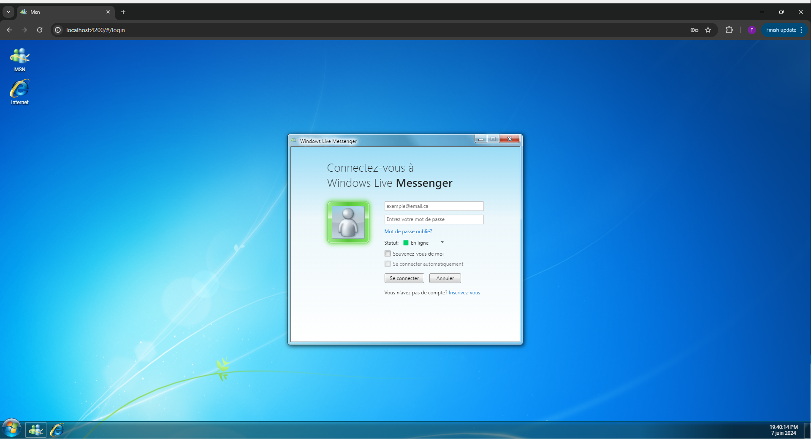
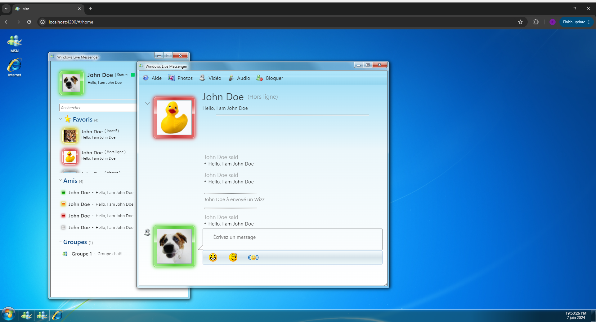
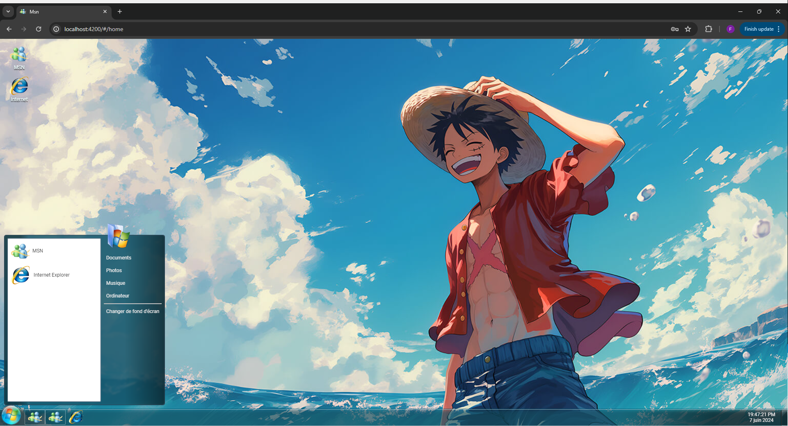

# Windows Live Messenger Client   made with Angular And Spring Boot
## Presentation
An attempt at recreating the Windows Live Messenger experience with Angular.  
It's also an attempt at recreating the windows 7 experience.

## Visuels

## Auteur
Nicholson Rainville Jacques

## Inspirations
- [Andy's desk](https://desk.glitchy.website/)

## Outils
- [Angular](https://angular.io/)
- [Spring Boot](https://spring.io/projects/spring-boot/)
- [7.css](https://khang-nd.github.io/7.css/)

